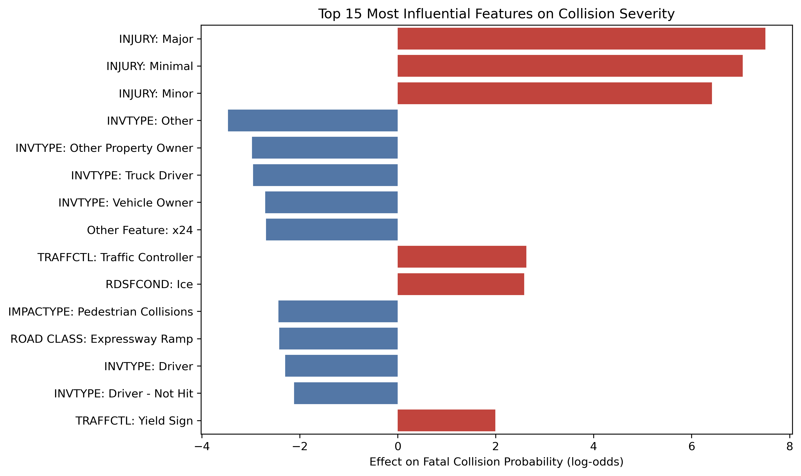

# 🚗 KSI Collision Severity Predictor  
*A Machine Learning project by Yohannes Tigabu*

### 🔗 Live Demo  

> Predict whether a Toronto traffic collision will result in a **Fatal** or **Non-Fatal Injury** using open police data.  
> Built with **Python · Scikit-Learn · Pandas · Streamlit** and deployed on **Streamlit Cloud**.

---

## 🎯 Objective
The goal of this project is to classify collision events as:
- **Fatal**, or  
- **Non-Fatal Injury**

using environmental, road, and temporal conditions.

---

## ⚙️ Tech Stack
Python · Pandas · Scikit-Learn (v1.4.2) · Seaborn · Matplotlib

---

## 🧠 Methodology
1. **Data Cleaning** – removed nulls, deduplicated collisions  
2. **Feature Engineering** – categorized age, encoded categorical variables  
3. **Imbalance Handling** – upsampled minority (Fatal) cases  
4. **Modeling** – Logistic Regression pipeline  
5. **Evaluation** – Accuracy, Precision, Recall, ROC-AUC  

---

## 📊 Results
| Metric | Score |
|--------|--------|
| Accuracy | 76.49% |
| Precision | 0.75 |
| Recall | 0.79 |
| ROC-AUC | (check figure below) |

---

### 🧮 Confusion Matrix

---

## 🔍 Key Insights
- **Lighting conditions** and **road class** strongly influence severity.  
- **Poor visibility** and **wet road surfaces** increase fatal risk.  
- **Arterial roads** show higher severity than local streets.  

---

## 🧩 Model Explainability
The top predictive factors are visualized below:

---

## ⚖️ Responsible Use
This model is for **educational and analytical purposes only**.  
It highlights **situational risk factors** — not individual responsibility.  
Predictions should not be used for enforcement or policy decisions.

---

## 📈 Visuals Summary
- Confusion Matrix → `assets/confusion_matrix.png`  
- ROC Curve → `assets/roc_curve.png`  
- Feature Importance → `assets/feature_importance.png`

---

## 📚 Data Source
[**Toronto Police Service — KSI Collisions Open Data**](https://data.torontopolice.on.ca/datasets/ksi)
